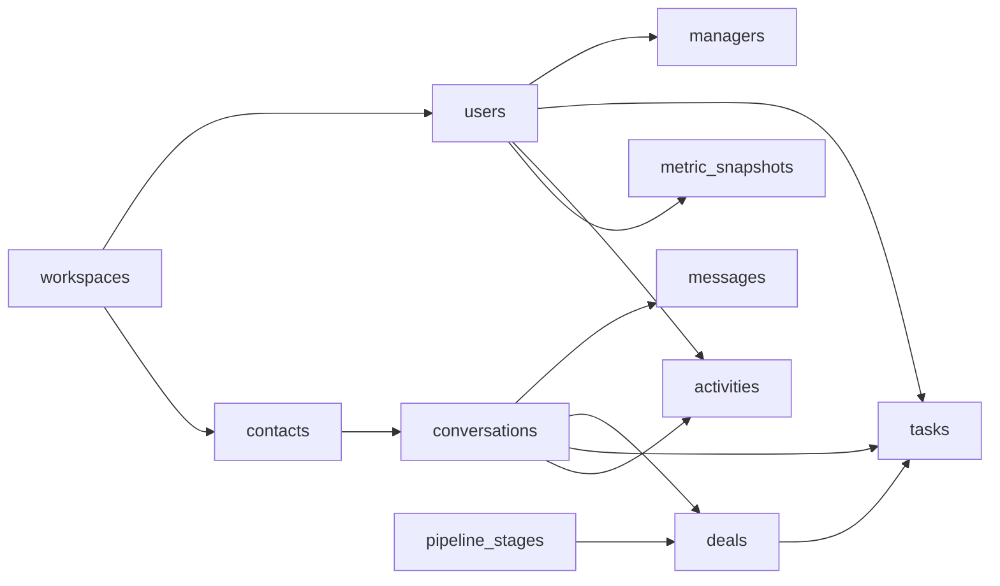

# ERD v1 (рабочая версия)

Ниже зафиксирована целевая структура БД для текущего этапа CRM.

## Обязательные индексы

- `messages(conversation_id, created_at)`
- `conversations(status, assigned_manager_id, updated_at)`
- `deals(stage, amount)`
- `tasks(workspace_id, status, due_at)`
- уникальность снапшота: `(workspace_id, manager_user_id, metric_key, period_start, period_end)`
